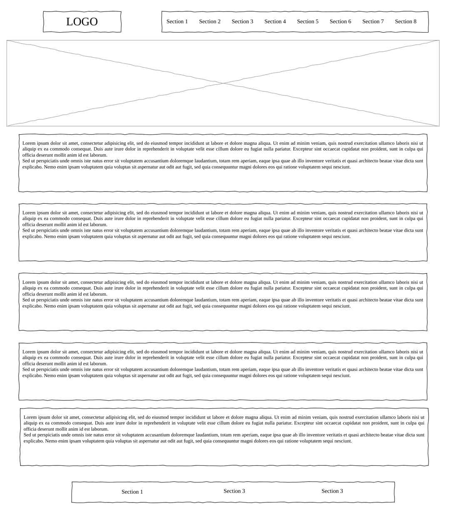

# Design

## Project's design overview

In this present project, we aim to create a website that offers free trainings to a variety of people from colorful cultural backgrounds. The trainings are varied in length and kinds. There are namely two types of trainings: 5 months and 8 months trainings. The 8-month program is for candidates who seek to become full-stack developers. And the 5-month program is for candidates who long to either become front-end or back-end developers.

Thus, basically, we will have to design a website with a navigation section that contains tabs that includes: program details, volunteer, about, recruit, blog, support us, why become a partner?, and FAQ. In body, there will be the main title under which nested three inline sections: who are we?, the program and the goal.

Right below it, another section that showcases our partners and sponsors.

Also, another section that displays testimonies of various alumni in which they share their experiences.

A section that suggests subscribing to our newsletters is included. And finally, in the footer: contact us, support, partnership and volunteer are added.

## Wireframe(s)

